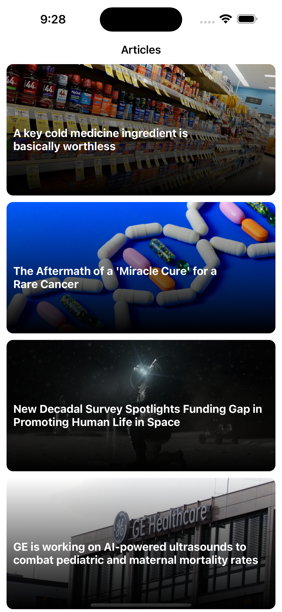
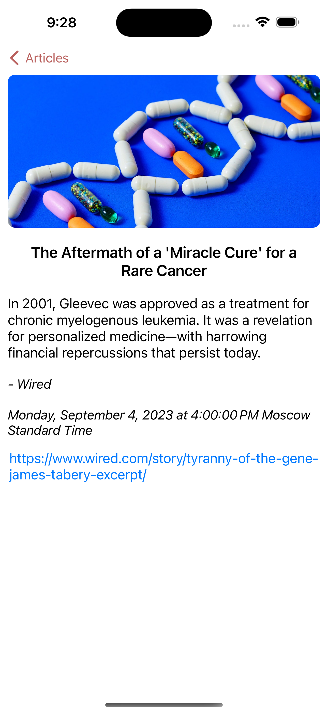
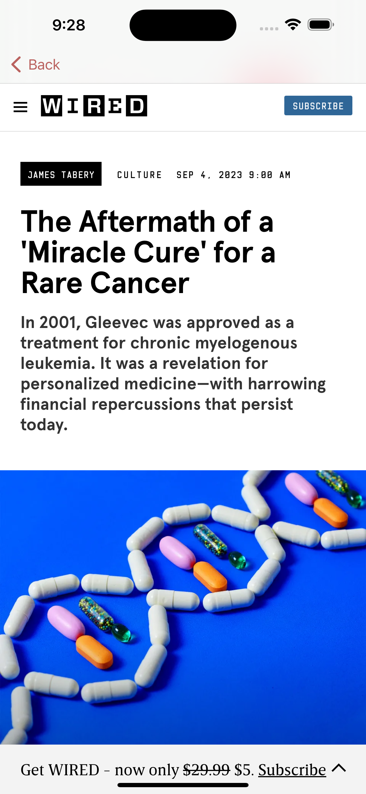

<!-- PROJECT LOGO -->
 

  

  <h3 align="center">News App</h3>

  

    UIKit & Combine news application
     
     
    <a href="https://github.com/othneildrew/Best-README-Template/issues">Report Bug</a>
    ·
    <a href="https://github.com/othneildrew/Best-README-Template/issues">Request Feature</a>
  

<!-- TABLE OF CONTENTS -->

  
Table of Contents

  <ol>
    <li>
      <a href="#about-the-project">About The Project</a>
      <ul>
        <li><a href="#built-with">Built With</a></li>
      </ul>
    </li>
    <li><a href="#app-screenshots">App Screenshots</a></li>
    <li><a href="#license">License</a></li>
  </ol>

<!-- ABOUT THE PROJECT -->
## About The Project

This is a simple training application using MVVM architecture and UIKit without third-party libraries. In 2022, it was a test task for an internship at Tinkoff fintech.

### Built With

* UIKit
* Combine
* URLSession

### App Screenshots

| Article List | Article | Article Full Text |
| ------- | ------------ | -------- |
|  |  |  |

<!-- LICENSE -->
## License

Distributed under the MIT License. See `LICENSE.txt` for more information.
